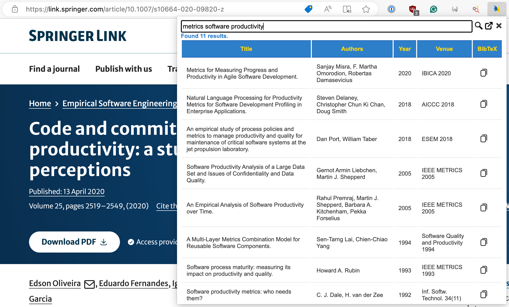

# dblp Search

A simple Chromium extension to ease the process of searching papers on [dblp.org](https://dblp.org) and copy BibTeX entries.

    

## Features

- **Search Papers**: Enter the title of the paper in the input field or highlight any text on the current web page, then click the search button. The extension will search for the paper on dblp.org and display the results.
- **Copy BibTeX Entries**: Next to each search result, there's a 'Copy BibTeX' button. Click this button to copy the BibTeX entry for the corresponding paper to your clipboard.
- **Results Count**: The extension shows the number of search results found.
- **Save Search State**: The state of the paper title input, status, and results are saved in the local storage. This allows you to leave the page and come back later without losing your search results.

## Usage

1. Install the extension to your Chromium browser (e.g., Chrome, Edge, ...).
2. Click on the extension icon to open the popup.
3. Enter the title of the paper you want to search for in the input field. Alternatively, highlight some text in the current web page.
4. Click the 'Search' button to start the search.
5. The search results will be displayed in the popup. Click the 'Copy BibTeX' button next to a result to copy its BibTeX entry to your clipboard.

## Contributions

Contributions are welcome! Please submit a pull request or create an issue to contribute to this project.

## License

This project is licensed under the terms of the MIT License. This means you are free to use, copy, modify, merge, publish, distribute, sublicense, and/or sell copies of the software or portions of it, given that you include the following copyright notice and permission notice in all copies or substantial portions of the software:
