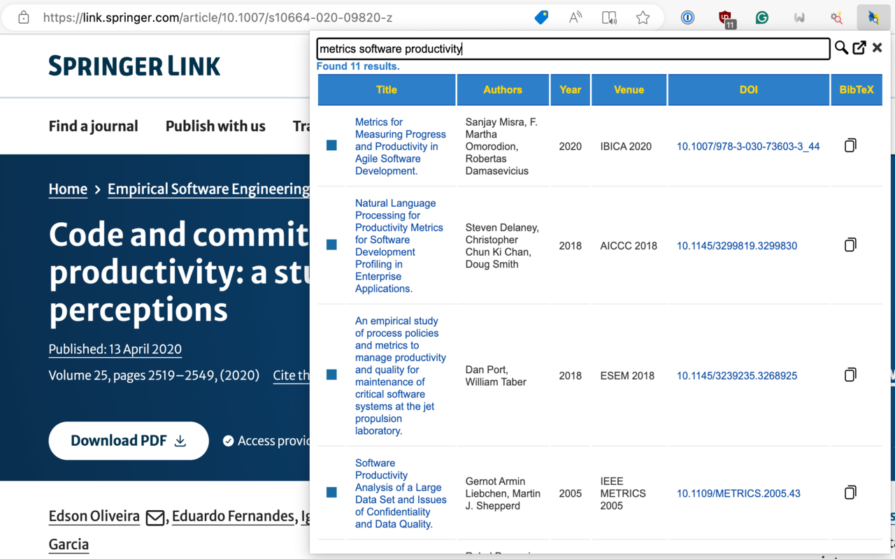

# dblp Search 


A simple cross-browser extension to ease the process of searching publications on [dblp.org](https://dblp.org) and copying BibTeX entries.

<p align="center">
    
</p>

<p align="center">
    <a href="https://chromewebstore.google.com/detail/dblp-search/onilpcgmnpikffebghpncnnapebndpaj?pli=1">
        
    </a>
    <a href="https://addons.mozilla.org/addon/dblp-search">
        
    </a>
    <a href="https://microsoftedge.microsoft.com/addons/detail/dblp-search/pgaajpodajaanapcpehobkdmkjpbhobd">
        
    </a>
</p>

## Features

- **Search Papers**: Enter the paper's title in the input field or highlight any text on the current web page, then click the search button. The extension will search dblp.org for matching publications and display the results.
- **Copy BibTeX Entries**: Next to each search result, there's a 'Copy BibTeX' button. Click this button to copy the BibTeX entry for the corresponding publication to your clipboard.
- **Customizable BibTeX Citation Keys**: Replace dblp default citation keys with a custom format. Use the drag-and-drop builder in Options to arrange fields (Author, Year, Venue, Title) and separators (dash, underscore) in any order. Additional formatting options include capitalizing the author's name and uppercasing the venue (e.g., `Calefato2023ESEM`, `calefato_2023_esem`).
- **Results Count**: The extension shows the number of search results found. The extension automatically filters out useless CoRR Abs entries.
- **Pagination**: Navigate through search results using Previous/Next buttons. Page info shows the current page, total pages, and result count. Pagination state persists across browser sessions.
- **Save Search State**: The content of the input text field and results are saved in the local storage. This allows you to leave the page and come back later without losing your search results.
- **API**: Versions 2+ are faster and more reliable as they rely on the official DBLP.org API to execute the queries.
- **Remove duplicates**: Useless, duplicated CoRR abs entries are filtered out.
- **Remove BibTeX fields**: When copying BibTeX entries, the extension can remove the `timestamp`, `bibsource`, `biburl`, and `url` fields.

## Usage

1. Install the extension to your Chromium browser (e.g., Chrome, Edge, ...), Firefox, or Safari.
2. Click on the extension icon to open the pop-up.
3. Enter the title of the paper you want to search for in the input field. Alternatively, highlight some text on the current web page.
4. Click the 'Search' button to start the search.
5. The search results will be displayed in the pop-up. Click the 'Copy BibTeX' button next to a result to copy its BibTeX entry to your clipboard.

## Contributions

Contributions are welcome! Please submit a pull request or create an issue to contribute to this project.

### Build Commands

```bash
make build/chrome      # Build Chrome extension ZIP
make build/firefox     # Build Firefox XPI addon
make build/safari      # Build Safari app-extension (macOS + Xcode required)
make build/edge        # Build Edge extension (same as Chrome)
make build/all         # Build all extensions
make build/clean       # Clean build directory and stamps
```

> [!NOTE]
> Safari build will start only on macOS if Xcode is installed.

### Manual installation

**Google Chrome**

1. Open Google Chrome and navigate to `chrome://extensions`.

2. Enable Developer mode by clicking the toggle switch next to "Developer mode".

3. Click "Load unpacked" and select the `build/chrome` directory in your project folder.

**Edge**

Same as above, the only difference is that you need to navigate to `edge://extensions`.

**Firefox** 

1. Open Firefox and navigate to `about:debugging`.

2. Click "This Firefox" and "Load Temporary Add-on...".

3. Navigate to the `build/firefox` directory in your project folder and select it.

### Development Commands

```bash
make run/chrome        # Launch Chrome with extension loaded (dev mode)
make run/firefox       # Launch Firefox Dev Edition with extension
make run/safari        # Launch Safari with extension
make run/edge          # Launch Edge with extension
make info              # Show development environment info
```

> [!NOTE]
> * Browser must not be running before executing `make run/*` commands
> * Unlike Chrome, Edge does not run in development mode
> * For Firefox, the script assumes you have [Firefox Developer Edition](https://www.mozilla.org/it/firefox/developer) installed. You can easily change the name to `Firefox` in the `make` script; it also requires `web-ext` to be installed.

### Release Workflow

```bash
make tag/patch         # Bump patch version (1.0.0 -> 1.0.1)
make tag/minor         # Bump minor version (1.0.0 -> 1.1.0)
make tag/major         # Bump major version (1.0.0 -> 2.0.0)
make tag/push          # Push to origin (triggers CI/CD release to stores)
```

Version is stored in `manifest.json` and synced to `manifest.firefox.json`.

### Testing

No automated test suite. Testing is manual:

1. Run `make run/chrome` (or firefox/safari/edge)
2. Test the modified functionality in the browser
3. Check the browser console for errors (pop-up and background service worker)

### Debugging

**Popup console**: Right-click extension icon → Inspect popup

**Background service worker**:
- Chrome: `chrome://extensions` → Find extension → "Service worker" link
- Firefox: `about:debugging` → This Firefox → Inspect

**Storage inspection**: In console, run `browser.storage.local.get(null, console.log)`

## Donations

<a href="https://www.paypal.com/donate?hosted_button_id=3BDBMD2HKRUKS"></a>
<a href="https://www.paypal.com/donate?hosted_button_id=3BDBMD2HKRUKS"></a>


## License

This project is licensed under the MIT license, see the [LICENSE](LICENSE) file.

## Credits
Developed by Fabio Calefato ([@bateman](https://github.com/bateman)).
