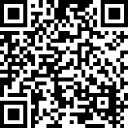

# dblp Search 

A simple cross-browser extension to ease the process of searching publications on [dblp.org](https://dblp.org) and copying BibTeX entries.

    

    
    
    

## Features

- **Search Papers**: Enter the title of the paper in the input field or highlight any text on the current web page, then click the search button. The extension will search for matching publications on dblp.org and display the results.
- **Copy BibTeX Entries**: Next to each search result, there's a 'Copy BibTeX' button. Click this button to copy the BibTeX entry for the corresponding publication to your clipboard.
- **Rename BibTex Citation Keys**: Replace dblp default citation keys with `<first author's lastname>`   `<year>` `<venue>` (e.g.,  `calefato2023esem`).
- **Results Count**: The extension shows the number of search results found. The extension automatically filters out useless CoRR Abs entries.
- **Save Search State**: The content of the input text field and results are saved in the local storage. This allows you to leave the page and come back later without losing your search results.

## Usage

1. Install the extension to your Chromium browser (e.g., Chrome, Edge, ...).
2. Click on the extension icon to open the popup.
3. Enter the title of the paper you want to search for in the input field. Alternatively, highlight some text in the current web page.
4. Click the 'Search' button to start the search.
5. The search results will be displayed in the popup. Click the 'Copy BibTeX' button next to a result to copy its BibTeX entry to your clipboard.

## Contributions

Contributions are welcome! Please submit a pull request or create an issue to contribute to this project.

## Donations

## License

This project is licensed under the MIT license, see the [LICENSE](LICENSE) file.
